# Gestión de Locales

Este documento contiene los comandos de **PowerShell** necesarios para interactuar con la API. 

> **Nota Importante:** Reemplaza los valores de `id` y `$TOKEN` por los reales antes de ejecutar.
Tambien considerar que el token AUTH obtenido despues de ejecutar el cliente tiene duracion de 1hr (Inspeccionar > Application > localStorage > http://localhost:5173)

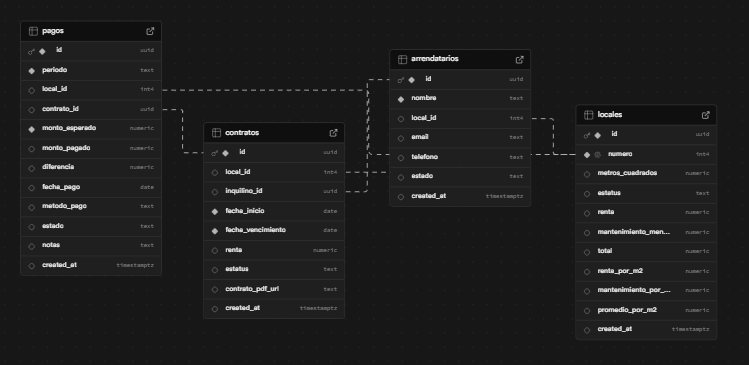
---

## PONER EL TOKEN
Ejecuta esto al abrir tu terminal:
```powershell
$TOKEN = "TU_TOKEN_AQUÍ"
```
Las url cambian con los deploy, es conveniente redeployar y sustituir si es necesario.

## READ (Consultar locales)
```powershell
Invoke-RestMethod -Method Get `
  -Uri "https://gestor-2h2k71rv7-fernandanevarez7171-gmailcoms-projects.vercel.app/api/locales" `
  -Headers @{ Authorization = "Bearer $TOKEN" } | ConvertTo-Json -Depth 10
  ```
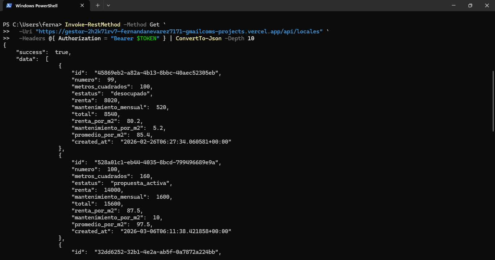

  ## CREATE (Crear nuevo local)
  ```powershell
  $body = @{
  numero = 105
  metros_cuadrados = 145
  estatus = "desocupado"
  renta = 12000
  mantenimiento_mensual = 1500
} | ConvertTo-Json

Invoke-RestMethod -Method Post `
  -Uri "https://gestor-2h2k71rv7-fernandanevarez7171-gmailcoms-projects.vercel.app/api/locales" `
  -Headers @{ Authorization = "Bearer $TOKEN"; "Content-Type" = "application/json" } `
  -Body $body | ConvertTo-Json -Depth 10
  ```
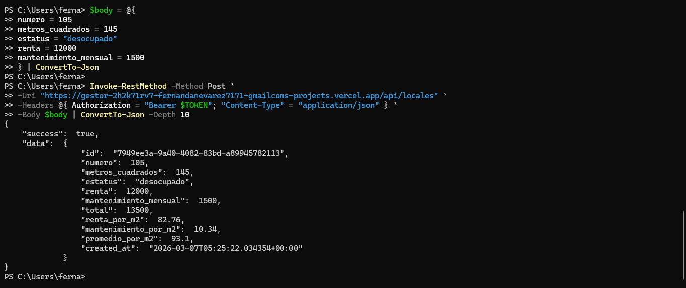
  
  ## UPDATE (Actualizar local)
  ```powershell
  $bodyUpdate = @{
  id = "7949ee3a-9a40-4082-83bd-a89945782113"
  numero = 105
  metros_cuadrados = 99
  estatus = "propuesta_activa"
  renta = 9999
  mantenimiento_mensual = 99
} | ConvertTo-Json

Invoke-RestMethod -Method Put `
  -Uri "https://gestor-2h2k71rv7-fernandanevarez7171-gmailcoms-projects.vercel.app/api/locales" `
  -Headers @{ Authorization = "Bearer $TOKEN"; "Content-Type" = "application/json" } `
  -Body $bodyUpdate | ConvertTo-Json -Depth 10
  ```
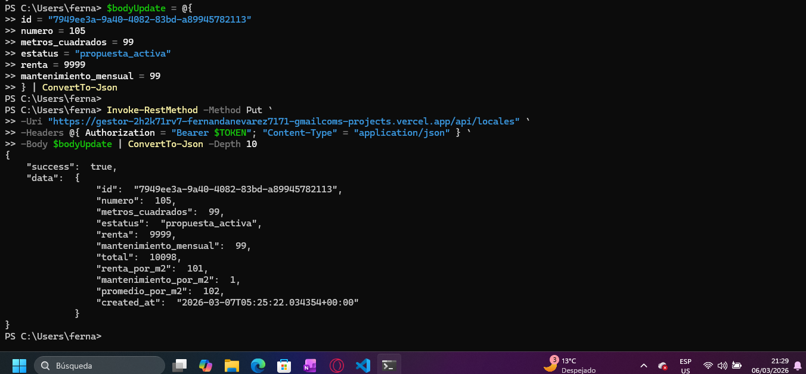
  
  ## DELETE (Eliminar local)
  ```powershell
 $TOKEN = "ES NECESARIO PONERLO JUNTITO"

$bodyDelete = @{ id = "7949ee3a-9a40-4082-83bd-a89945782113"; action = "delete" } | ConvertTo-Json

Invoke-RestMethod -Method Post -Uri "https://gestor-7i1clbiuk-fernandanevarez7171-gmailcoms-projects.vercel.app/api/locales" -Headers @{ Authorization = "Bearer $TOKEN"; "Content-Type" = "application/json" } -Body $bodyDelete
  ```

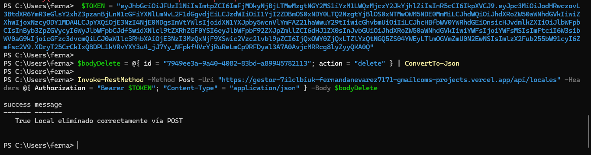
  
  ## INSERTAR UN ARRENDATARIO
  ```powershell
 $body = @{
  nombre = "Juan Pérez"
  local_id = 100  # Debe existir en la tabla locales
  email = "juan@ejemplo.com"
  telefono = "555-1234"
  estado   = "pendiente"
} | ConvertTo-Json
Invoke-RestMethod -Method Post -Uri " https://gestor-k6uryjzwc-fernandanevarez7171-gmailcoms-projects.vercel.app/api/arrendatarios" -Headers @{ Authorization = "Bearer $TOKEN"; "Content-Type" = "application/json" } -Body $body
  ```
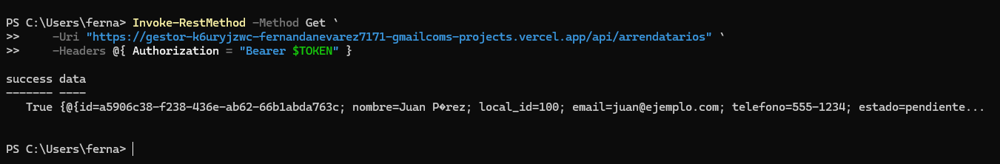
  
  ## ACTUALIZAR DATOS DE UN ARRENDATARIO
  ```powershell
$updateBody = @{
    id       = "a5906c38-f238-436e-ab62-66b1abda763c"
    nombre   = "Juan Pérez"
    local_id = 100
    email    = "juan_nuevo@ejemplo.com"
    telefono = "555-9999"
    estado   = "atrasado"
} | ConvertTo-Json

Invoke-RestMethod -Method Put `
    -Uri "https://gestor-k6uryjzwc-fernandanevarez7171-gmailcoms-projects.vercel.app/api/arrendatarios" `
    -Headers @{ Authorization = "Bearer $TOKEN"; "Content-Type" = "application/json" } `
    -Body $updateBody
  ```


## ELIMINAR UN ARRENDATARIO
  ```powershell
$bodyDelete = @{ 
  id = "a5906c38-f238-436e-ab62-66b1abda763c"
  action = "delete" 

} | ConvertTo-Json

Invoke-RestMethod -Method Post -Uri "https://gestor-k6uryjzwc-fernandanevarez7171-gmailcoms-projects.vercel.app/api/arrendatarios" -Headers @{ Authorization = "Bearer $TOKEN"; "Content-Type" = "application/json" } -Body $bodyDelete
  ```

  
## CONSULTAR LOS ARRENDATARIOS
  ```powershell
$respuesta = Invoke-RestMethod -Method Get `
    -Uri "https://gestor-k6uryjzwc-fernandanevarez7171-gmailcoms-projects.vercel.app/api/arrendatarios" `
    -Headers @{ Authorization = "Bearer $TOKEN" }

$respuesta.data | Format-Table id, nombre, estado, email
  ```

---

## CREAR UN CONTRATO
  ```powershell
$body = @{
    local_id          = 100
    inquilino_id      = "02d1da52-a400-41a8-a6e0-6c5f8f829d3a"
    fecha_inicio      = "2026-03-06"
    fecha_vencimiento = "2027-03-06"
    renta             = 15000
    estatus           = "activo"
} | ConvertTo-Json

Invoke-RestMethod -Method Post -Uri "https://gestor-12ez05mt8-fernandanevarez7171-gmailcoms-projects.vercel.app/api/contratos" `
  -Headers @{ Authorization = "Bearer $TOKEN"; "Content-Type" = "application/json" } -Body $body
  ```
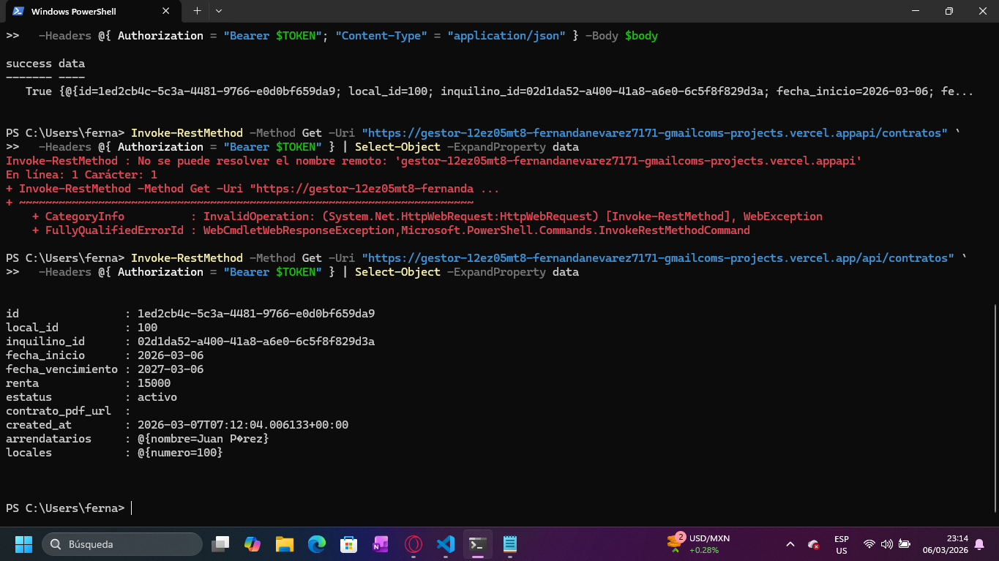
  
## LEER LOS CONTRATOS
  ```powershell
Invoke-RestMethod -Method Get -Uri "https://gestor-12ez05mt8-fernandanevarez7171-gmailcoms-projects.vercel.app/api/contratos" `
  -Headers @{ Authorization = "Bearer $TOKEN" } | Select-Object -ExpandProperty data
  ```

  ## ACTUALIZAR (ESTADO DEL CONTRATO)
  ```powershell

$bodyUpdate = @{
    id      = "1ed2cb4c-5c3a-4481-9766-e0d0bf659da9"
    estatus = "vencido"
} | ConvertTo-Json

Invoke-RestMethod -Method Put -Uri "https://gestor-12ez05mt8-fernandanevarez7171-gmailcoms-projects.vercel.app/api/contratos" `
  -Headers @{ Authorization = "Bearer $TOKEN"; "Content-Type" = "application/json" } -Body $bodyUpdate
  ```
  Los valores aceptables son "activo", "vencido" y "cancelado"


  
  ## BORRAR (ESTADO DEL CONTRATO)
  ```powershell
$bodyDelete = @{ id = "1ed2cb4c-5c3a-4481-9766-e0d0bf659da9"; action = "delete" } | ConvertTo-Json

Invoke-RestMethod -Method Post -Uri " https://gestor-12ez05mt8-fernandanevarez7171-gmailcoms-projects.vercel.app/api/contratos" `
  -Headers @{ Authorization = "Bearer $TOKEN"; "Content-Type" = "application/json" } -Body $bodyDelete
  ```

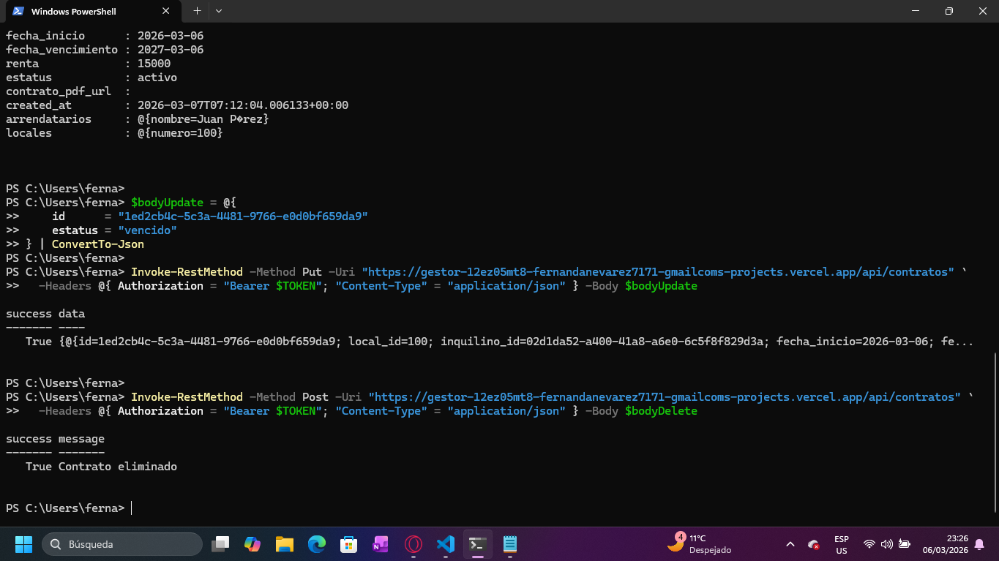
  
  
  ## CREAR UN PAGO
  ```powershell
$bodyPago = @{
    periodo        = "Marzo 2026"
    local_id       = 100
    contrato_id    = "1f549c39-c455-41d3-9ee6-747fa1e4faf1"
    monto_esperado = 15000
    monto_pagado   = 15000
    fecha_pago     = "2026-03-06"
    metodo_pago    = "transferencia" # Debe ser minúscula
    notas          = "Pago completo"
} | ConvertTo-Json

Invoke-RestMethod -Method Post -Uri "https://gestor-nez2fd8c2-fernandanevarez7171-gmailcoms-projects.vercel.app/api/pagos" `
  -Headers @{ Authorization = "Bearer $TOKEN"; "Content-Type" = "application/json" } `
  -Body $bodyPago
  ```
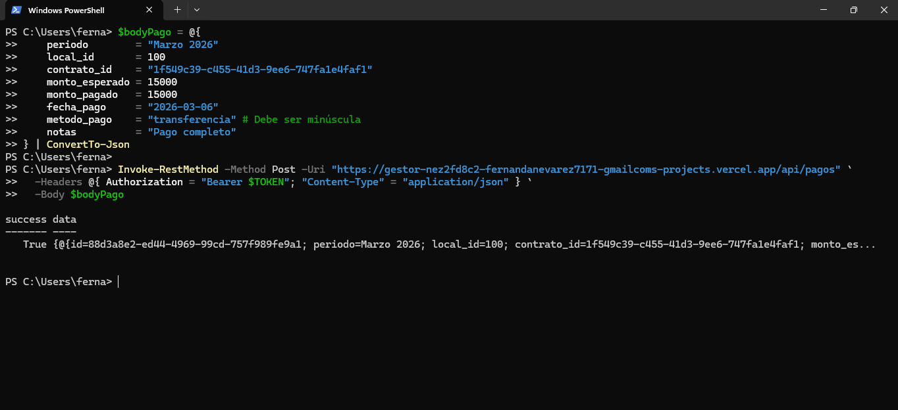

  ## READ (Consultar pagos)
  ```powershell
$respuesta = Invoke-RestMethod -Method Get -Uri "https://gestor-nez2fd8c2-fernandanevarez7171-gmailcoms-projects.vercel.app/api/pagos" `
  -Headers @{ Authorization = "Bearer $TOKEN" }

# Para verlo como una tabla limpia en tu terminal:
$respuesta.data | Format-Table periodo, monto_esperado, monto_pagado, diferencia, estado, metodo_pago
  ```
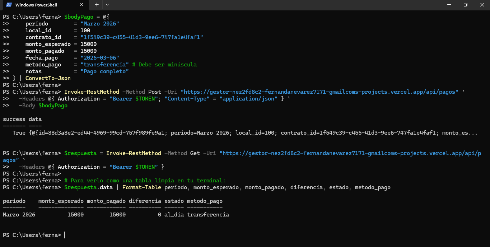

 ## UPDATE (Actualizar pagos)
  ```powershell
$bodyUpdate = @{
    id           = "88d3a8e2-ed44-4969-99cd-757f989fe9a1"
    monto_pagado = 15000
    metodo_pago  = "transferencia"
    notas        = "Se corrigió el monto, ya está liquidado"
} | ConvertTo-Json

Invoke-RestMethod -Method Put -Uri "https://gestor-nez2fd8c2-fernandanevarez7171-gmailcoms-projects.vercel.app/api/pagos" `
  -Headers @{ Authorization = "Bearer $TOKEN"; "Content-Type" = "application/json" } `
  -Body $bodyUpdate
  ```

   ## UPDATE (Actualizar pagos)
  ```powershell
$bodyUpdate = @{
    id           = "88d3a8e2-ed44-4969-99cd-757f989fe9a1"
    monto_pagado = 15000
    metodo_pago  = "transferencia"
    notas        = "Se corrigió el monto, ya está liquidado"
} | ConvertTo-Json

Invoke-RestMethod -Method Put -Uri "https://gestor-nez2fd8c2-fernandanevarez7171-gmailcoms-projects.vercel.app/api/pagos" `
  -Headers @{ Authorization = "Bearer $TOKEN"; "Content-Type" = "application/json" } `
  -Body $bodyUpdate
  ```

  
   ## DELETE (eliminar un pago)
  ```powershell
$bodyDelete = @{ 
    id     = "88d3a8e2-ed44-4969-99cd-757f989fe9a1"
    action = "delete" 
} | ConvertTo-Json

Invoke-RestMethod -Method Post -Uri "https://gestor-nez2fd8c2-fernandanevarez7171-gmailcoms-projects.vercel.app/api/pagos" `
  -Headers @{ Authorization = "Bearer $TOKEN"; "Content-Type" = "application/json" } `
  -Body $bodyDelete
  ```
  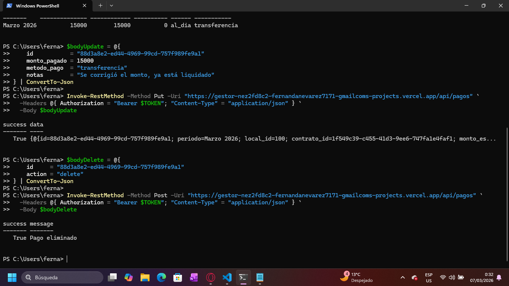